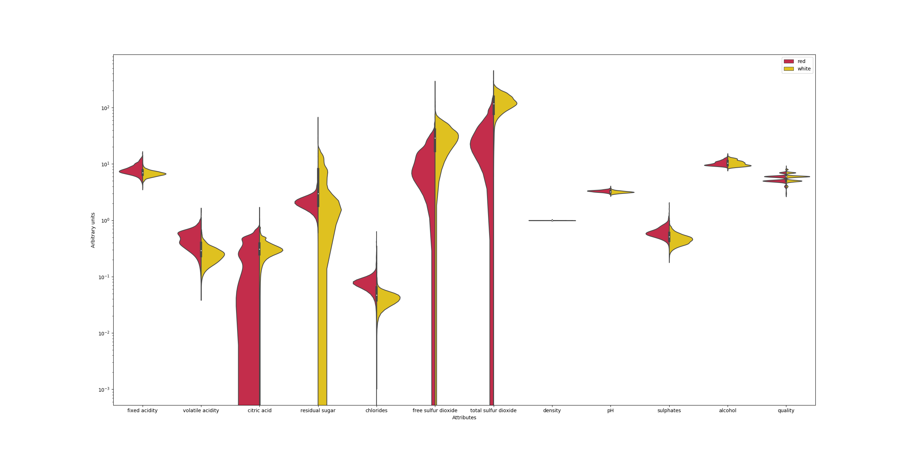
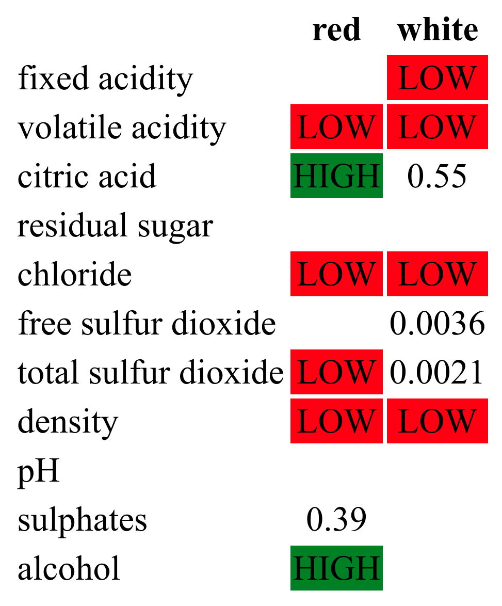

Predicting and classifying wines based on physical and chemical properties}
===

*this is a migrated version of a 2-page TeX report, now available in the /tex directory.*

Wine is a [circa $300b industry](https://www.zionmarketresearch.com/report/wine-market), and somewhat unique in the modern age; whilst most consumer goods are 
specified and produced in a controlled manner with [six sigma type methods](https://www.isixsigma.com/new-to-six-sigma/what-six-sigma/), wine varies significantly not just between brands, but between batches.  A producer has an obvious question: what factors make a wine "good"?

Method:
---

The [UCI wines dataset](http://archive.ics.uci.edu/ml/machine-learning-databases/wine-quality/) consists of 6497 wines (1599 red, 4898 white) which have been assigned a quality rating (the dependent variable) from 0-10. 10 (independent) variables have been measured: fixed and volatile acidity, citric acid levels, residual sugar, chlorides, free and total sulfur dioxide, density, pH, sulphates and alcohol content (the dataset is complete, though units are not provided). 

Using [pandas](https://pandas.pydata.org/), the csv files (actually semicolon-delimited) can be imported directly from URL, and usefully assigned `.name` metadata:

```
red_wines = pd.read_csv(data_url + red_filename, delimiter=";")
red_wines.name = "red"
white_wines = pd.read_csv(data_url + white_filename, delimiter=";")
white_wines.name = "white"
```

Types of Wine
---

On a superficial level, there are clearly two types of wine: red and white.  T-test of the two datasets confirms they are significantly (P < 0.01) different in every measured variable, although alcohol content is marginal. Red wines have greater (fixed and volatile) acidity, chlorides and sulphates, and white wines have greater citric acid (132 red wines had no detectable citric acid at all), residual sugar, and (free and total) sulfur dioxide.



The below chart illustrates correlation between different measured properties (darker colours indicate a greater association).  Some correlations are intuitive; 
e.g. citric acid, fixed acidity and low pH are all correlated.  Density is correlated with many factors in both red and white wines: this may also be intuitive as density is an aggregate property of the constituent chemicals.  Alcohol content is sensibly correlated with a lower density (alcohol has a lower density than water), 
fixed acidity and residual sugars are correlated with higher density.  For red wines only, chlorides are correlated with sulphates.


Finding predictors of a high taste score
---

It would be reasonable to assume that that winemakers have already roughly optimised each chemical present where possible, so that there are one of three possibilities for each chemical:

* The ideal concentration lies somewhere in the region being investigated (quadratic fit),
* The ideal concentration is zero, the species is a contaminant
* That's a nice chemical, put more in...

In the first case, we are looking for a quadratic.  In the latter two cases, logarithmic fits would be possible - but so would simple linear fits, so let's use them.

Properties matching the stricter quadratic criteria are: for red wines, sulphates and citric acid; 
for white wines, free and total sulfur dioxide.  For red wine only, increasing alcohol content increased perceived quality (P < 0.01).  
For both types, volatile acidity, chloride and density should be minimised.

Quality red wines (scoring 6 or higher) have on average significantly (P < 0.01) lower volatile acidity, higher citric acid (and therefore lower pH), higher sulphates, and higher alcohol, than poor reds (scoring 4 or lower).  Quality white wines (scoring 6 or higher) have on average significantly (P < 0.01) lower fixed and volatile acidity, higher residual sugar, lower chlorides, higher free sulfur dioxide but not total sulfur dioxide, lower density, than poor whites (scoring 4 or lower).

Both scored higher for higher alcohol content.  Combining this with quadratic regressions, predictors of wine quality are
summarised below:


